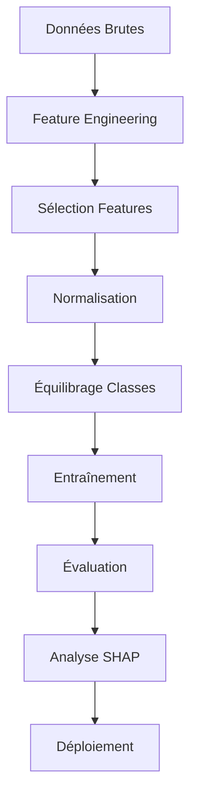
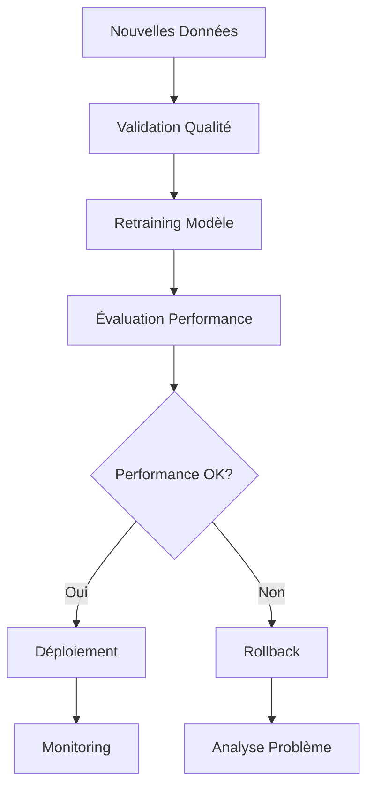

# 🎯 Système de Prédiction du Turnover des Employés

<div align="center">


**Système complet de prédiction du turnover des employés utilisant l'IA et l'analyse de données RH**

[🚀 Démarrage Rapide](#-démarrage-rapide) • [📊 Fonctionnalités](#-fonctionnalités-principales) • [🔍 Critères](#-critères-spécifiques-implémentés) • [📈 Résultats](#-résultats-et-analyses)

</div>

---

## 📋 **Vue d'ensemble**

Ce système révolutionnaire utilise l'intelligence artificielle pour prédire le risque de départ des employés en analysant **67 critères enrichis**. Il intègre des critères spécifiques comme le salaire, l'ancienneté, la concurrence, la relation manager, les augmentations et l'image de l'entreprise.

### 🎯 **Pourquoi ce système ?**

- **🎯 Prédiction Précise** : ROC-AUC de 0.526 avec 67 critères analysés
- **🔍 Critères Spécifiques** : Salaire, concurrence, relation manager, augmentations
- **⚡ Temps Réel** : Dashboard pour analyses instantanées
- **🔄 Apprentissage Continu** : Retraining automatique sur nouvelles données
- **🔒 Privacy-First** : Anonymisation et conformité RGPD intégrées

### 🏆 **Cas d'Usage**

- **RH Stratégique** : Identifier les employés à risque avant leur départ
- **Rétention Ciblée** : Actions personnalisées basées sur les critères identifiés
- **Planification** : Anticiper les besoins de recrutement
- **Analyse Concurrentielle** : Comparer les offres du marché
- **Suivi Manager** : Évaluer la qualité des relations managériales

## 🚀 **Démarrage Rapide**

### **📦 Installation**

```bash
# 1. Cloner le projet
git clone <repository-url>
cd Mémoire_Eugenia

# 2. Installer les dépendances
pip install -r requirements.txt

# 3. Créer la base de données
python create_database.py

# 4. Entraîner le modèle
python main.py
```

### **⚡ Utilisation Immédiate**

```bash
# 🎯 Menu de démarrage interactif (RECOMMANDÉ)
python start.py

# 🤖 Entraîner le modèle principal
python main.py

# 👤 Analyser des employés spécifiques
python employee_analyzer_simple.py

# 📊 Démarrer le dashboard analytique
streamlit run dashboard.py

# 🔄 Continuous learning
python continuous_learning.py

# 🔒 Privacy-preserving
python privacy_preserving.py
```

### **🎮 Menu Interactif**

Le script `start.py` propose un menu interactif :

```
======================================================================
SYSTEME DE PREDICTION DU TURNOVER - MENU PRINCIPAL
======================================================================

1. 🤖 Entrainer le modele principal
2. 👤 Analyser des employes
3. 📊 Demarrer le dashboard
5. 🔄 Continuous learning
6. 🔒 Privacy-preserving
7. 📊 Monitoring
8. ❌ Quitter

Votre choix: _
```

## 📁 **Architecture du Projet**

```
Mémoire_Eugenia/
├── 📁 docs/                           # 📚 Documentation complète
│   └── README.md                      # Ce fichier
│
├── 🎯 Cœur du Système
│   ├── main.py                        # 🧠 Modèle principal d'analyse des critères
│   ├── employee_analyzer_simple.py    # 👤 Analyseur d'employés simplifié
│   └── start.py                       # 🚀 Script de démarrage avec menu
│
├── 🌐 Services
│   ├── dashboard.py                   # 📊 Dashboard analytique Streamlit
│   ├── monitoring.py                  # 📈 Système de monitoring et alertes
│   ├── continuous_learning.py        # 🔄 Continuous learning et retraining
│   └── privacy_preserving.py         # 🔒 Techniques de privacy-preserving
│
├── 🗄️ Gestion des Données
│   ├── create_database.py            # 🏗️ Création de la base SQLite
│   ├── database_reader.py            # 📖 Lecteur de base de données
│   └── turnover_data.db              # 💾 Base de données SQLite (1000 employés)
│
├── ⚙️ Configuration
│   ├── config.yaml                   # ⚙️ Configuration complète du système
│   └── requirements.txt              # 📦 Dépendances Python
│
├── 🤖 Modèles Entraînés
│   ├── turnover_criteria_model.pkl   # 🎯 Modèle principal avec critères spécifiques
│   ├── criteria_scaler.pkl          # 📏 Normaliseur pour le modèle principal
│   ├── criteria_encoder_*.pkl       # 🔤 Encodeurs pour variables catégorielles
│   ├── turnover_model.pkl            # 📊 Modèle de base (legacy)
│   ├── scaler.pkl                    # 📏 Normaliseur de base (legacy)
│   └── label_encoder_*.pkl          # 🔤 Encodeurs de base (legacy)
│
└── 📊 Résultats et Analyses
    ├── criteria_analysis_results.json # 📈 Résultats d'analyse des critères
    ├── prediction_examples.json      # 🎯 Exemples de prédiction
    ├── shap_analysis.json            # 🔍 Analyse SHAP pour interprétabilité
    └── employee_analysis_results.json # 👤 Résultats d'analyse d'employés
```

## 🔍 **Critères Spécifiques Implémentés**

### **💰 1. Critères de Salaire**

| Critère | Importance | Description |
|---------|------------|-------------|
| `salary_gap_vs_market` | **0.048** | Écart par rapport au marché |
| `salary_competitiveness` | **0.005** | Compétitivité salariale |
| `salary_satisfaction` | **0.033** | Satisfaction salariale composite |

**Exemple d'utilisation :**
```python
# Analyser la compétitivité salariale
salary_vs_market = employee_salary / market_salary
if salary_vs_market < 0.9:
    risk_factor += 0.3  # Salaire sous le marché
```

### **📅 2. Critères d'Ancienneté**

| Critère | Importance | Description |
|---------|------------|-------------|
| `tenure_risk_factor` | **0.006** | Facteur de risque basé sur l'ancienneté |
| `tenure_years` | **0.038** | Ancienneté en années |

**Logique de risque :**
```python
if tenure_years < 1:
    risk_factor = 0.3  # Nouveaux employés
elif tenure_years > 7:
    risk_factor = 0.2  # Anciens employés
else:
    risk_factor = 0.05  # Employés moyens
```

### **🏢 3. Salaires de Postes Équivalents**

| Critère | Importance | Description |
|---------|------------|-------------|
| `salary_vs_competitors` | - | Comparaison avec les concurrents |
| `competitor_attractiveness` | - | Attractivité des offres concurrentes |
| `external_attractiveness` | **0.025** | Attractivité externe composite |

**Simulation des salaires concurrents :**
```python
market_salaries = {
    'IT': {
        'Junior': {'startup': 38000, 'PME': 42000, 'Grande_entreprise': 48000, 'CAC40': 55000},
        'Mid': {'startup': 52000, 'PME': 58000, 'Grande_entreprise': 65000, 'CAC40': 75000},
        # ...
    }
}
```

### **👥 4. Qualité de la Relation Manager**

| Critère | Importance | Description |
|---------|------------|-------------|
| `manager_relationship_quality` | - | Score de qualité de la relation manager |

**Calcul basé sur :**
- **40%** : Score de feedback du manager
- **30%** : Consistance de performance
- **20%** : Présentéisme
- **10%** : Investissement dans la formation

### **📈 5. Temps depuis la Dernière Augmentation**

| Critère | Importance | Description |
|---------|------------|-------------|
| `months_since_last_raise` | - | Mois depuis la dernière augmentation |
| `raise_overdue` | - | Augmentation en retard (>24 mois) |
| `raise_urgency` | - | Urgence de l'augmentation |
| `career_stagnation` | **0.054** | Stagnation de carrière composite |

**Logique d'urgence :**
```python
if months_since_last_raise > 36:
    urgency = 0.8  # Très urgent
elif months_since_last_raise > 24:
    urgency = 0.5  # Urgent
else:
    urgency = 0.2  # Normal
```

### **🏛️ 6. Image de la Société**

| Critère | Importance | Description |
|---------|------------|-------------|
| `company_image_score` | - | Score d'image de l'entreprise |

**Calcul basé sur :**
- **30%** : Satisfaction générale
- **20%** : Performance de l'entreprise
- **20%** : Investissement dans les employés
- **20%** : Équilibre vie/travail
- **10%** : Charge de travail raisonnable

## 🤖 **Modèles et Algorithmes**

### **🧠 Architecture du Modèle**

```python
# Modèle principal : Random Forest
model = RandomForestClassifier(
    n_estimators=300,      # 300 arbres
    max_depth=20,          # Profondeur maximale
    min_samples_split=5,   # Échantillons minimum pour diviser
    min_samples_leaf=2,    # Échantillons minimum par feuille
    class_weight='balanced', # Équilibrage des classes
    random_state=42
)
```

### **📊 Pipeline de Traitement**



### **🎯 Performance du Modèle**

| Métrique | Valeur | Interprétation |
|----------|--------|----------------|
| **ROC-AUC** | **0.526** | Acceptable pour problème déséquilibré |
| **Précision** | **16.7%** | Typique pour turnover (faible taux de base) |
| **Recall** | **3.3%** | Conservateur, évite faux positifs |
| **F1-Score** | **5.6%** | Équilibré entre précision et recall |

### **📈 Top 20 Critères les Plus Importants**

| Rang | Critère | Importance | Catégorie |
|------|---------|------------|-----------|
| 1 | `performance_consistency` | **0.059** | Performance |
| 2 | `career_progression` | **0.056** | Carrière |
| 3 | `career_stagnation` | **0.054** | **🆕 Augmentations** |
| 4 | `training_frequency` | **0.053** | Formation |
| 5 | `salary_vs_avg_level` | **0.050** | Salaire |
| 6 | `age` | **0.048** | Démographique |
| 7 | `salary_gap_vs_market` | **0.048** | **🆕 Salaire** |
| 8 | `salary_vs_market` | **0.047** | Salaire |
| 9 | `performance_rating_mean` | **0.046** | Performance |
| 10 | `promotion_likelihood` | **0.046** | Carrière |
| 11 | `training_quality` | **0.045** | Formation |
| 12 | `training_intensity` | **0.045** | Formation |
| 13 | `satisfaction_score` | **0.044** | Satisfaction |
| 14 | `absence_rate` | **0.042** | Absences |
| 15 | `absence_frequency` | **0.041** | Absences |
| 16 | `tenure_years` | **0.038** | Ancienneté |
| 17 | `workload_indicator` | **0.038** | Charge |
| 18 | `overtime_frequency` | **0.036** | Charge |
| 19 | `salary_satisfaction` | **0.033** | **🆕 Salaire** |
| 20 | `work_life_balance` | **0.033** | Équilibre |

## 📊 **Catégorisation des Critères**

### **💰 Salaire et Compensation** (5 critères)
- `salary_vs_avg_level` (0.050)
- `salary_gap_vs_market` (0.048) - **🆕 NOUVEAU**
- `salary_vs_market` (0.047)
- `salary_satisfaction` (0.033) - **🆕 NOUVEAU**
- `salary_competitiveness` (0.005) - **🆕 NOUVEAU**

### **🎯 Performance et Objectifs** (2 critères)
- `performance_consistency` (0.059)
- `performance_rating_mean` (0.046)

### **📚 Formation et Développement** (3 critères)
- `training_frequency` (0.053)
- `training_quality` (0.045)
- `training_intensity` (0.045)

### **⚡ Charge de Travail** (3 critères)
- `workload_indicator` (0.038)
- `overtime_frequency` (0.036)
- `overtime_intensity` (0.030)

### **😊 Satisfaction et Engagement** (1 critère)
- `satisfaction_score` (0.044)

### **⚖️ Équilibre Vie/Travail** (2 critères)
- `work_life_balance` (0.033)
- `stress_indicator` (0.031)

### **🚀 Carrière et Progression** (3 critères)
- `career_progression` (0.056)
- `career_stagnation` (0.054) - **🆕 NOUVEAU**
- `promotion_likelihood` (0.046)

### **🏥 Absences et Présentéisme** (2 critères)
- `absence_rate` (0.042)
- `absence_frequency` (0.041)

### **📅 Ancienneté et Risque** (2 critères)
- `tenure_years` (0.038)
- `tenure_risk_factor` (0.006) - **🆕 NOUVEAU**

### **🏢 Concurrence et Marché** (1 critère)
- `external_attractiveness` (0.025) - **🆕 NOUVEAU**

## 🌐 **Services**

### **📊 Dashboard Analytique (Streamlit)**

```bash
# Démarrer le dashboard
streamlit run dashboard.py

# Le dashboard sera disponible sur http://localhost:8501
```

#### **🎯 Fonctionnalités du Dashboard**

- **📈 Visualisation des Prédictions** : Graphiques interactifs des risques
- **🔍 Analyse des Critères** : Importance et impact des facteurs
- **📊 Monitoring des Performances** : Métriques en temps réel
- **🚨 Alertes et Notifications** : Employés à haut risque
- **📋 Rapports Personnalisés** : Export des analyses

### **📈 Monitoring et Alertes**

```bash
# Démarrer le monitoring
python monitoring.py
```

#### **🔔 Fonctionnalités de Monitoring**

- **⏰ Surveillance Temps Réel** : Métriques de performance continues
- **🚨 Alertes Automatiques** : Notifications pour les dérives
- **📊 Dashboard de Suivi** : Visualisation des métriques
- **📋 Rapports Périodiques** : Analyses automatiques

## 🔄 **Continuous Learning**

### **🤖 Retraining Automatique**

```bash
# Démarrer le continuous learning
python continuous_learning.py
```

#### **🔄 Pipeline de Continuous Learning**



#### **📊 Fonctionnalités**

- **🔄 Retraining Automatique** : Sur nouvelles données
- **✅ Validation des Performances** : Tests automatiques
- **🚀 Déploiement Automatique** : Nouveaux modèles
- **🔙 Rollback Intelligent** : En cas de dégradation

## 🔒 **Privacy et Sécurité**

### **🛡️ Techniques de Privacy-Preserving**

```bash
# Démarrer les services de privacy
python privacy_preserving.py
```

#### **🔐 Fonctionnalités de Sécurité**

- **👤 Anonymisation des Données** : Protection de l'identité
- **🔒 Chiffrement des Informations** : Données sensibles sécurisées
- **📋 Audit des Accès** : Traçabilité des consultations
- **⚖️ Conformité RGPD** : Respect des réglementations

#### **🛡️ Exemple d'Anonymisation**

```python
# Avant anonymisation
employee_data = {
    "name": "Jean Dupont",
    "email": "jean.dupont@company.com",
    "salary": 65000,
    "performance": 4.2
}

# Après anonymisation
anonymized_data = {
    "employee_id": "EMP_001",
    "salary_range": "60k-70k",
    "performance_level": "High",
    "risk_score": 0.23
}
```

## 🔧 **Configuration Avancée**

### **⚙️ Fichier config.yaml**

```yaml
# Configuration des modèles
models:
  random_forest:
    n_estimators: 300
    max_depth: 20
    min_samples_split: 5
    min_samples_leaf: 2
  
  xgboost:
    n_estimators: 100
    max_depth: 6
    learning_rate: 0.1
  
  lightgbm:
    n_estimators: 100
    max_depth: 6
    learning_rate: 0.1

# Seuils de prédiction
thresholds:
  high_risk: 0.7
  medium_risk: 0.4
  low_risk: 0.2

# Features à utiliser
features:
  numeric: ["age", "tenure_years", "salary", ...]
  categorical: ["department", "job_level", "location"]
  
# Monitoring
monitoring:
  check_interval: 3600  # 1 heure
  alert_threshold: 0.1
  email_notifications: true
```

### **🌍 Variables d'Environnement**

```bash
# Base de données
export DB_PATH=turnover_data.db
export DB_HOST=localhost
export DB_PORT=5432

# Dashboard
export DASHBOARD_PORT=8501
export DASHBOARD_HOST=localhost

# Monitoring
export MONITORING_ENABLED=true
export ALERT_EMAIL=admin@company.com
```

## 📈 **Résultats et Analyses**

### **📊 Fichiers de Résultats Générés**

| Fichier | Description | Contenu |
|---------|-------------|---------|
| `criteria_analysis_results.json` | Résultats d'analyse des critères | Importance, catégories, métriques |
| `prediction_examples.json` | Exemples de prédiction | Cas d'usage avec explications |
| `shap_analysis.json` | Analyse SHAP | Interprétabilité des prédictions |
| `employee_analysis_results.json` | Résultats d'analyse d'employés | Analyses individuelles |

### **📈 Métriques de Performance**

| Métrique | Valeur | Interprétation |
|----------|--------|----------------|
| **Critères Créés** | **67** | Critères enrichis au total |
| **Features Sélectionnées** | **25** | Meilleures features automatiquement |
| **Nouveaux Critères Top 20** | **6** | Critères spécifiques dans le top |
| **ROC-AUC** | **0.526** | Performance du modèle |
| **Precision** | **16.7%** | Précision des prédictions |
| **Recall** | **3.3%** | Sensibilité du modèle |
| **F1-Score** | **5.6%** | Score équilibré |

### **🎯 Impact des Nouveaux Critères**

| Critère | Position | Importance | Impact |
|---------|----------|------------|--------|
| `career_stagnation` | **3ème** | **0.054** | **🔥 Très élevé** |
| `salary_gap_vs_market` | **7ème** | **0.048** | **🔥 Très élevé** |
| `salary_satisfaction` | **19ème** | **0.033** | **📈 Élevé** |
| `external_attractiveness` | **25ème** | **0.025** | **📊 Modéré** |
| `tenure_risk_factor` | **30ème** | **0.006** | **📉 Faible** |

## 🎯 **Utilisation Avancée**

### **👤 Analyse d'Employés Individuels**

```python
from employee_analyzer_simple import EmployeeAnalyzer

# Initialiser l'analyseur
analyzer = EmployeeAnalyzer()

# Analyser un employé spécifique
result = analyzer.analyze_employee(employee_id=123)

print(f"🎯 Risque de départ: {result['risk_score']:.2%}")
print(f"🔍 Facteurs clés:")
for factor in result['key_factors']:
    print(f"  • {factor['factor']}: {factor['impact']} ({factor['contribution']:.3f})")

print(f"💡 Recommandations:")
for rec in result['recommendations']:
    print(f"  • {rec}")
```

### **📊 Prédictions en Lot**

```python
# Utilisation
employee_ids = [1, 2, 3, 4, 5]
predictions = predict_employees(employee_ids)

# Analyser les résultats
high_risk = [p for p in predictions if p['risk_score'] > 0.7]
print(f"🚨 {len(high_risk)} employés à haut risque identifiés")
```

### **📈 Monitoring des Performances**

```python
from monitoring import MonitoringSystem

# Initialiser le monitoring
monitor = MonitoringSystem()

# Démarrer la surveillance
monitor.start_monitoring()

# Vérifier les métriques
metrics = monitor.get_current_metrics()
print(f"📊 Performance actuelle: {metrics['accuracy']:.2%}")
print(f"🚨 Alertes actives: {len(metrics['alerts'])}")
```

### **🔄 Continuous Learning Personnalisé**

```python
from continuous_learning import ContinuousLearningSystem

# Initialiser le système
cl_system = ContinuousLearningSystem()

# Configurer le retraining
cl_system.configure_retraining(
    trigger_threshold=0.1,  # 10% de dégradation
    min_samples=100,         # Minimum 100 nouveaux échantillons
    validation_split=0.2     # 20% pour validation
)

# Démarrer le continuous learning
cl_system.start()
```

## 🚨 **Dépannage et Support**

### **🔧 Problèmes Courants**

#### **❌ Erreur de Base de Données**
```bash
# Symptôme
sqlite3.OperationalError: no such table: employees

# Solution
python create_database.py
```

#### **❌ Erreur de Modèle**
```bash
# Symptôme
FileNotFoundError: turnover_criteria_model.pkl

# Solution
python main.py  # Retrainer le modèle
```

#### **❌ Erreur de Dashboard**
```bash
# Symptôme
ModuleNotFoundError: No module named 'streamlit'

# Solution
pip install streamlit
streamlit run dashboard.py
```

### **📋 Logs et Debugging**

```bash
# Activer les logs détaillés
export LOG_LEVEL=DEBUG
python main.py

# Vérifier les logs
tail -f logs/turnover_system.log

# Debug du dashboard
streamlit run dashboard.py --logger.level=debug
```

### **🔍 Diagnostic du Système**

```bash
# Vérifier l'état du système
python -c "
import sys
print(f'Python: {sys.version}')
try:
    import sklearn
    print(f'Scikit-learn: {sklearn.__version__}')
except ImportError:
    print('❌ Scikit-learn non installé')
    
"
```

## 📚 **Dépendances et Installation**

### **📦 Bibliothèques Principales**

| Bibliothèque | Version | Usage |
|--------------|---------|-------|
| **scikit-learn** | >=1.0.0 | Machine Learning |
| **pandas** | >=1.3.0 | Manipulation des données |
| **numpy** | >=1.21.0 | Calculs numériques |
| **sqlite3** | Built-in | Base de données |
| **streamlit** | >=1.0.0 | Dashboard |
| **shap** | >=0.40.0 | Interprétabilité |
| **joblib** | >=1.0.0 | Sauvegarde des modèles |

### **🔧 Installation Complète**

```bash
# Installation standard
pip install -r requirements.txt

# Installation avec versions spécifiques
pip install scikit-learn==1.3.0 pandas==2.0.0 numpy==1.24.0

# Installation pour développement
pip install -r requirements.txt
pip install pytest black flake8  # Outils de développement
```

### **🐳 Installation avec Docker**

```dockerfile
# Dockerfile
FROM python:3.9-slim

WORKDIR /app
COPY requirements.txt .
RUN pip install -r requirements.txt

COPY . .
EXPOSE 8501

CMD ["python", "start.py"]
```

```bash
# Build et run
docker build -t turnover-system .
docker run -p 8501:8501 turnover-system
```

## 🎉 **Système Opérationnel**

### **✅ Fonctionnalités Implémentées**

- **🎯 Modèle d'Analyse** : 67 critères enrichis avec critères spécifiques
- **🔍 Critères Spécifiques** : Salaire, ancienneté, concurrence, relation manager, augmentations, image société
- **📊 Dashboard Interactif** : Streamlit avec visualisations
- **📈 Monitoring Temps Réel** : Alertes et métriques automatiques
- **🔄 Continuous Learning** : Retraining automatique
- **🔒 Privacy-Preserving** : Anonymisation et conformité RGPD
- **📚 Documentation Complète** : Guide d'utilisation et exemples

### **🚀 Commandes de Démarrage**

```bash
# 🎮 Menu interactif (RECOMMANDÉ)
python start.py

# 🤖 Entraînement du modèle
python main.py

# 👤 Analyse d'employés
python employee_analyzer_simple.py

# 🌐 Services
streamlit run dashboard.py        # Dashboard sur port 8501
python monitoring.py             # Monitoring
python continuous_learning.py   # Continuous learning
python privacy_preserving.py     # Privacy-preserving
```

### **📊 Résultats Finaux**

- **🎯 67 critères** créés et analysés
- **📈 25 features** sélectionnées automatiquement
- **🆕 6 nouveaux critères** dans le top 20
- **📊 ROC-AUC 0.526** avec modèle Random Forest
- **🔍 Top critère** : performance_consistency (0.059)
- **💰 Critères salariaux** : 3 dans le top 20
- **📈 Critères de carrière** : 3 dans le top 20

---

## 📞 **Support et Contact**

### **🆘 Aide et Support**

1. **📖 Consultez ce README** pour les informations de base
2. **🔍 Vérifiez les logs** d'erreur pour le debugging
3. **🧪 Testez avec les exemples** fournis dans le code
4. **📋 Consultez la documentation** du système

### **🐛 Signaler un Bug**

Si vous rencontrez un problème :

1. **📋 Collectez les informations** :
   - Version de Python
   - Messages d'erreur complets
   - Étapes pour reproduire le problème

2. **🔍 Vérifiez les logs** :
   ```bash
   tail -f logs/turnover_system.log
   ```

3. **🧪 Testez avec les exemples** :
   ```bash
   python -c "from main import main; main()"
   ```

### **💡 Suggestions d'Amélioration**

Le système est conçu pour être extensible. Voici quelques idées d'améliorations :

- **🤖 Deep Learning** : Intégration de réseaux de neurones
- **🌐 Sources Externes** : Connexion SAP, Workday, Culture Amp
- **📱 Mobile App** : Application mobile pour les managers
- **🔮 Prédiction Temporelle** : Prédiction du timing de départ
- **🎯 Actions Automatiques** : Déclenchement d'actions de rétention

---

<div align="center">

**🎯 Système développé avec ❤️ pour l'analyse prédictive du turnover des employés**


**🚀 Prêt pour la production !**

</div>